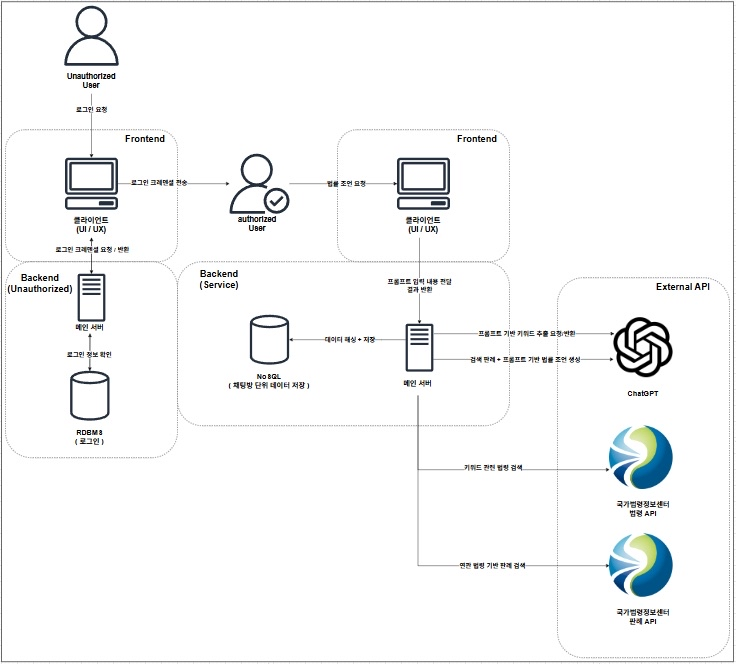

# MoleLaw
법률 API와 연계한 AI 기반 법률 조언 서비스.

- *본 ReadMe 에선 Frontend 중심의 사항을 다룹니다. Backend와 관련된 사항은 https://github.com/24Sahmyook-Team-s1/MoleLaw_backend 해당 레포지토리에서 확인하실 수 있습니다.*

## 개요

법은 어렵습니다. 현행 법령만 5,943건 
자치법규까지 합하면 150,000건을 훌쩍 넘어가죠. 
하지만 법은 **알아야 합니다**.  
아는 것은 힘이고 그 힘이 중요한 순간에 저희를 지켜줄테니까요.

저희는 이런 생각을 합니다. '*법을 사람이 모두 알기에 어려움이 있다면, 단순히 법을 찾고 적용 가능성을 확인하는걸 도와줄 파트너가 있다면 사람들의 부담이 줄어들지 않을까?*' 하고요.

그래서 저희는 국가 법령 정보센터에서 제공하는 법률 API 와 AI 서비스를 연동하여, 실제 법률에 기반한 조언 서비스 **MoleLaw** 를 개발하게 되었습니다.

## 팀원

김정현 (@ranpia) | Lead
- Backend 코드 총괄
- Backend Server Engineer
- Project Management
- API Management

차성호 (@WhiteMilk357) | Backend Engineer
- Backend Enginner
- Chatbot System
- System Architecture

박민수 (@OdeliaRoav) | Backend Engineer
- Backend Engineer
- Data Encryption
- Authorization System

김재욱 (@Jaek-Kein) | Frontend Engineer
- Frontend Design
- Frontend Development
- Frontend Server Enginner
- Service Architecture Design

## 서비스 아키텍쳐

서비스 아키텍처는 위와같이 구성하였습니다. 
서비스 아키텍처를 구성하면서 **2가지를* * 중점적으로 고민하였습니다.

1. 개인정보(법률상담)을 다루는 서비스임으로 **로그인 기반** 서비스일것.
2. 데이터의 대부분을 법률 API에서 가져옴으로써 **데이터 신뢰도**를 향상시킬것.

## 프론트엔드 기술 스택

### 프레임워크
#### - React

### 언어
#### - Typescript

### 스타일링
#### - CSS
#### - @emotion

### 클라이언트
#### - Axios

### 상태 관리 
#### - Zustand
 
 

## 디자인

디자인을 하면서 